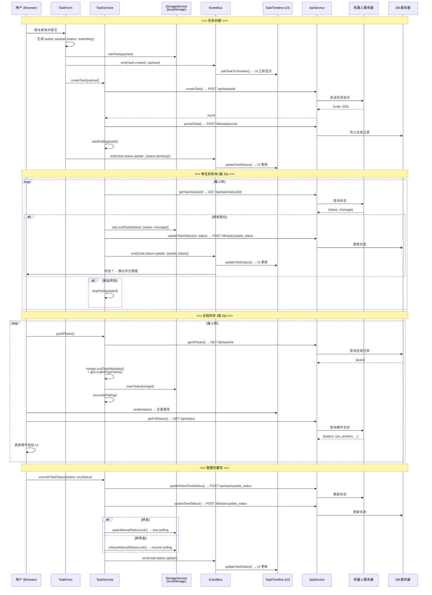

# 任务执行流程 - 数据流向图

## 系统架构概览

```
┌──────────────┐     ┌──────────────┐     ┌──────────────┐
│   客户端      │     │   DB 服务器   │     │   机器人      │
│  (Browser)   │     │ (10.208.40.  │     │ (Robot)      │
│              │     │   25:18080)  │     │              │
│  - TaskForm  │     │              │     │ - 任务执行    │
│  - Timeline  │     │ - 任务持久化  │     │ - 状态上报    │
│  - Detail    │     │ - 用户认证    │     │ - 视频流      │
│  - Video     │     │ - 任务列表    │     │ - 环境检测    │
└──────┬───────┘     └──────┬───────┘     └──────┬───────┘
       │                    │                    │
       │  HTTP/REST         │  HTTP/REST         │
       │  (fetch CORS)      │  (内部通信)         │
       │                    │                    │
       └────────────────────┴────────────────────┘
```

---

## 1. 任务创建流程 (Task Creation)

```
用户提交表单
     │
     ▼
┌─────────────────────────────────────────────────────────────┐
│ TaskForm.handleSubmit()                                     │
│                                                             │
│ 1. 生成 taskId (UUID), serial, createTime                   │
│ 2. 构建 payload {                                           │
│      id, type, description, location, priority,             │
│      execute_time, use_memory, model, model_selection,      │
│      status: "submitting",  ← 初始状态                      │
│      creator, user_preference_summary, robot_profile_summary│
│    }                                                        │
└──────────┬──────────────────────────────────────────────────┘
           │
           ├──▶ 3. storageService.addTask(payload)
           │       └── 写入 localStorage["robot_monitor_tasks"]
           │
           ├──▶ 4. eventBus.emit('task:created', payload)
           │       └── TaskTimeline.addTaskToTimeline()
           │            └── UI 立即显示 (status: submitting, 灰色点)
           │
           ▼
    5. taskService.createTask(payload)
           │
           ├──▶ 6. POST /api/task/add → 机器人
           │       │    (apiService.createTask)
           │       │
           │       ├── result.code === 200 (机器人接受)
           │       │    │
           │       │    ├──▶ 7. POST /db/task/persist → DB 服务器
           │       │    │       将任务写入数据库
           │       │    │
           │       │    └──▶ 8. taskService.startPolling(taskId)
           │       │            │
           │       │            ├── 立即调用 checkTaskStatus(taskId)
           │       │            │   └── GET /api/task/status/{id} → 机器人
           │       │            │
           │       │            └── 每 3 秒轮询 (setInterval)
           │       │                └── GET /api/task/status/{id} → 机器人
           │       │
           │       └── result.code !== 200 (机器人拒绝)
           │            └── 不持久化，不轮询
           │
           ├──▶ 9a. 成功: eventBus.emit('task:status-update', {status:'pending'})
           │            └── TaskTimeline.updateTaskStatus() → UI 更新为 Pending
           │
           └──▶ 9b. 失败: eventBus.emit('task:status-update', {status:'failed'})
                        └── TaskTimeline.updateTaskStatus() → UI 更新为 Failed
```

### 关键状态变化
```
submitting → (机器人接受) → pending → (机器人执行) → executing → (完成) → finished/completed
                                                                      └→ (失败) → failed
```

---

## 2. 任务状态轮询流程 (Per-Task Polling, 每 3 秒)

```
setInterval (每 3 秒触发)
     │
     ▼
┌─────────────────────────────────────────────────────────────┐
│ taskService.checkTaskStatus(taskId)                         │
│                                                             │
│ 1. 检查 manualStatusLocked → 锁定则跳过                      │
│ 2. 检查 localStorage 缓存 → 已是终态则停止轮询               │
│                                                             │
│ 3. GET /api/task/status/{id} → 机器人                        │
│       │                                                     │
│       ├── 状态无变化 → 什么都不做                              │
│       │                                                     │
│       └── 状态有变化 ─────────────────────┐                  │
│                                           ▼                  │
│  4. setLocalTaskState(taskId, {status, message})             │
│     └── 更新 localStorage                                    │
│                                           │                  │
│                                           ▼                  │
│  5. POST /db/task/update_status → DB 服务器                  │
│     └── 仅更新 DB 中的状态字段                                 │
│                                           │                  │
│                                           ▼                  │
│  6. eventBus.emit('task:status-update', {taskId, status})   │
│     └── TaskTimeline.updateTaskStatus()                      │
│     └── main.js: 检查是否终态 → 弹出评分弹窗                  │
│                                           │                  │
│                                           ▼                  │
│  7. 如果是终态 (completed/failed/finished) → stopPolling()    │
└─────────────────────────────────────────────────────────────┘
```

---

## 3. 全局同步流程 (Global Sync, 每 5 秒)

```
setInterval (每 5 秒触发)
     │
     ▼
┌─────────────────────────────────────────────────────────────┐
│ main.updateAllStatus()                                      │
│                                                             │
│ ┌─────────────────────────────────────────────────────┐     │
│ │ A. syncTasksFromServer()                            │     │
│ │                                                     │     │
│ │   GET /db/task/list → DB 服务器 (获取全部任务)        │     │
│ │       │                                             │     │
│ │       ▼                                             │     │
│ │   taskService.getAllTasks()                         │     │
│ │   ├── 1. mergeLocalTaskMetadata()                   │     │
│ │   │     合并 localStorage 中的以下字段:               │     │
│ │   │     - display_type, model_selection, model       │     │
│ │   │     - manualStatusLocked (管理员强制状态覆盖)     │     │
│ │   │                                                │     │
│ │   ├── 2. getLocalInFlightTasks()                    │     │
│ │   │     找出 localStorage 中有但服务端没有的          │     │
│ │   │     pending/submitting/executing 任务并合并      │     │
│ │   │     → 防止服务端延迟导致本地任务消失              │     │
│ │   │                                                │     │
│ │   ├── 3. sortTasksByCreateTime() 按时间倒序          │     │
│ │   │                                                │     │
│ │   └── 4. storageService.saveTasks() 写回 localStorage│     │
│ │                                                     │     │
│ │   → 返回合并后的任务列表                               │     │
│ │                                                     │     │
│ │   taskService.reconcilePolling(tasks)                │     │
│ │   ├── 为 pending/executing 任务启动轮询               │     │
│ │   └── 对终态任务停止轮询                               │     │
│ │                                                     │     │
│ │   taskTimeline.render(tasks)  ← 全量重绘 UI          │     │
│ │   updateAdminStats(tasks)     ← 更新统计面板         │     │
│ │   restoreSelectedTask()       ← 恢复选中状态         │     │
│ └─────────────────────────────────────────────────────┘     │
│                                                             │
│ ┌─────────────────────────────────────────────────────┐     │
│ │ B. 硬件状态更新                                       │     │
│ │                                                     │     │
│ │   GET /api/status → 机器人 (完整状态)                  │     │
│ │   ├── battery_percentage → updateBatteryUI()         │     │
│ │   ├── current_velocity  → updateVelocityUI()         │     │
│ │   ├── cpu_usage         → updateCpuUI()              │     │
│ │   ├── network_latency   → updateLatencyUI()          │     │
│ │   ├── memory_usage      → updateMemoryUI()           │     │
│ │   ├── current_position  → updatePositionUI()         │     │
│ │   ├── daily_distance    → updateDistanceUI()         │     │
│ │   └── joint_states      → updateJointsUI()           │     │
│ └─────────────────────────────────────────────────────┘     │
│                                                             │
│ ┌─────────────────────────────────────────────────────┐     │
│ │ C. 全局状态更新                                       │     │
│ │   updateGlobalTaskStatus()                           │     │
│ │   └── 更新顶部状态栏: "Working" / "Idle"               │     │
│ └─────────────────────────────────────────────────────┘     │
└─────────────────────────────────────────────────────────────┘
```

---

## 4. 事件驱动更新流程

```
EventBus 核心事件

┌──────────────────────────────────────────────────────────────────┐
│                                                                  │
│  task:created                                                     │
│  ├── TaskTimeline.addTaskToTimeline() → 立即在 UI 添加新任务       │
│  └── (payload 已含 status: 'submitting')                          │
│                                                                  │
│  task:status-update                                               │
│  ├── TaskTimeline.updateTaskStatus() → 更新 UI 状态徽章/点         │
│  ├── main.js handler                                             │
│  │   ├── 终态(status)？                                           │
│  │   │   ├── Yes → 检查是否是当前用户创建 + 未评分                 │
│  │   │   │         └── 1秒后弹出 RatingModal                      │
│  │   │   └── 更新 admin stats                                     │
│  │   └── 当前选中任务详情？→ 轻量刷新详情面板                       │
│  └── (status update from: polling / manual-override / form)       │
│                                                                  │
│  task:deleted                                                     │
│  └── TaskTimeline.removeTask() → 从 UI 移除                       │
│                                                                  │
│  task:selected                                                    │
│  └── main.renderTaskDetail() → 渲染右侧详情面板                     │
│                                                                  │
│  task:deselected                                                  │
│  └── main.hideTaskDetail() → 隐藏详情面板                          │
│                                                                  │
│  task:republished (每 10 分钟自动重发 submitting 任务)             │
│  └── main.showToast() → 提示用户任务正在重新发送                   │
│                                                                  │
│  task:rated                                                       │
│  └── main.loadTasks() → 重新从 DB 加载全部任务 + 刷新详情          │
│                                                                  │
│  auth:login → main.startApp() → 启动所有服务                       │
│  auth:logout → main.stopApp() → 停止所有服务, 显示登录页           │
│                                                                  │
│  presence:update → updateOnlineUsersUI() → 更新在线用户列表        │
│                                                                  │
└──────────────────────────────────────────────────────────────────┘
```

---

## 5. 管理员状态覆写流程

```
管理员点击 "Modify Status" → 选择新状态
     │
     ▼
taskService.overrideTaskStatus(taskId, newStatus)
     │
     ├── 1. 先检查 DB 中是否已是终态 (syncPersistedTerminalStatus)
     │      └── 是 → 跳过覆写
     │
     ├── 2. POST /api/task/update_status → 机器人端
     │      └── updateRobotTaskStatus() 
     │
     ├── 3. POST /db/task/update_status → DB 服务器
     │      └── updateTaskStatus()
     │
     ├── 4a. 新状态是终态 → applyManualStatusLock()
     │       ├── setLocalTaskState({manualStatusLocked: true})
     │       ├── stopPolling() (停止自动轮询)
     │       └── emit('task:status-update')
     │
     └── 4b. 新状态非终态 → releaseManualStatusLock()
             ├── setLocalTaskState({manualStatusLocked: false})
             ├── syncTaskStateToFrontend()
             └── 恢复轮询
```

---

## 6. 本地缓存与远端数据合并策略

```
localStorage                    DB Server
  (本地缓存)                     (权威数据源)
      │                              │
      ├─ display_type ◄── 本地优先 ──┤
      ├─ model_selection ◄── 本地优先──┤
      ├─ model ◄────────── 本地优先 ──┤
      ├─ manualStatusLocked ◄─ 本地───┤
      ├─ status (locked时) ◄─ 本地 ──┤
      │                              │
      └─ 其余字段 ◄── 以 DB 为准 ────┘

合并逻辑 (mergeLocalTaskMetadata):
  1. 以 DB 返回的任务列表为基础
  2. 逐个匹配 localStorage 中的同名任务
  3. 本地专属字段 (display_type / model_selection / model) 覆盖 DB
  4. 如果管理员锁定了状态 → 本地 status/message 覆盖 DB
  5. 找出 DB 中没有、但本地是 pending/executing 的任务 → 追加到列表末尾
```

---

## 7. 当前系统的核心问题与修改建议

---

### 问题 1: 三地状态不同步

**根因**: 机器人内存队列、DB 持久化、客户端 localStorage 各自维护一份状态，且通过不同路径更新。

**现状**:
```
客户端 → 轮询机器人 → 客户端写 DB（客户端是状态同步的中介）
```

**修改建议 — 将 DB 确立为唯一权威数据源**:

1. **机器人直连 DB**: 机器人端的状态变更（pending→executing→finished/failed）由机器人**主动写入 DB**，不再依赖客户端轮询后中转写入。这样机器人和 DB 始终保持一致。

2. **客户端只读 DB**: 客户端的 `checkTaskStatus()` 不再同时承担"查状态 + 写 DB"两个职责。轮询只从 DB 拉数据用于 UI 展示，不再写入 DB。

3. **localStorage 降级为纯 UI 层缓存**: 只存 `display_type`、`model_selection`、`manualStatusLocked` 等**前端专属字段**，不再缓存 `status`。状态字段始终以 DB 返回值为准（manualStatusLocked 的场景除外）。

4. **具体改动点**:
   - `taskService.checkTaskStatus()`: 去掉 `updateTaskStatus()` 调用（不再由客户端写 DB），只保留 emit event 更新 UI
   - 机器人端新增状态上报逻辑：状态变更时调用 `POST /db/task/update_status`
   - `mergeLocalTaskMetadata()`: 默认不覆盖 status，除非 `manualStatusLocked === true`

---

### 问题 2: 全量重绘导致 UI 闪烁

**根因**: `syncTasksFromServer()` 每 5 秒调用 `taskTimeline.render()` → `container.innerHTML = ...` 全量重建 DOM。

**修改建议 — 增量 DOM 更新（Diff-Patch 策略）**:

1. **在 TaskTimeline 中新增 `patch(tasks)` 方法**，替代 `render()` 用于周期性刷新：
   - 将现有 DOM 节点按 `data-task-id` 建立 Map
   - 将新任务列表按 `id` 建立 Map
   - **新增**: 新任务不在 DOM Map 中 → `renderTaskItem()` 插入
   - **删除**: DOM 中有但新列表没有 → `remove()` 移除
   - **更新**: 两者都有但 `status` / `message` 变化 → 调用现有的 `updateTaskStatus()` 局部更新 DOM（不重建整个卡片）

2. **保留 `render()` 仅用于首屏加载和筛选切换**（这些场景需要全量重建）。

3. **保存/恢复 UI 状态**:
   - patch 前记录 `scrollTop`
   - patch 前记录 `selectedTaskId`
   - patch 后恢复滚动位置和选中高亮

4. **具体改动点**:
   - `taskTimeline`: 新增 `patch(tasks)` 方法
   - `main.syncTasksFromServer()`: 首屏调用 `render()`，后续周期调用 `patch()`
   - 新增 `main._isFirstSync` 标记区分首次和后续同步

---

### 问题 3: submitting/pending 状态卡死

**根因**: 没有超时机制。任务提交后如果机器人宕机/重启/丢弃任务，DB 中的记录永远停留在 submitting/pending。

**修改建议 — 增加超时自动失败机制**:

1. **在 DB 服务器端增加定时任务**: 扫描 `create_time` 超过 N 分钟（建议 30 分钟）且状态仍为 `pending` 或 `submitting` 的任务，自动标记为 `failed`，message 设为 "Task timed out - robot did not execute"。

2. **客户端增加本地超时保护**: 在 `cleanupStaleLocalTasks()`（已有空壳）中实现逻辑——localStorage 中 `submitting` 超过 10 分钟且 DB 中查不到的任务，直接丢弃。

3. **创建流程增加失败回滚**: 如果 `apiService.createTask()` 失败（机器人拒绝或网络错误），不应调用 `persistTask()`（当前代码逻辑已经 protect 了这一点，但需要确认 `catch` 中是否正确处理了已写入 localStorage 的 task）。

4. **具体改动点**:
   - DB 服务器: 新增定时任务（cron/job），扫描超时 pending/submitting 任务
   - `taskService.cleanupStaleLocalTasks()` / `filterExpiredSubmittingTasks()`: 实现超时过滤逻辑
   - `taskService.createTask()`: 机器人调用失败时，立即将 localStorage 中的任务标记为 `failed`

---

### 问题 4: 轮询与全局同步的双写冲突

**根因**: 两条独立的更新链路同时操作同一任务的同一字段。

```
路径 A (3s): 机器人 → checkTaskStatus → setLocalTaskState → updateTaskStatus(DB) → emit event
路径 B (5s): DB → getAllTasks → mergeLocal → saveTasks(localStorage) → render(全量)
```

当 A 和 B 在相近时刻执行时：A 刚更新完 localStorage 和 DOM，B 紧接着用 DB 的旧数据覆盖了 localStorage 并重建 DOM。

**修改建议 — 合并为单一路径**:

1. **去掉客户端中转写 DB**（配合问题 1 的方案）：`checkTaskStatus()` 不再调用 `updateTaskStatus()`。DB 更新完全由机器人端负责。

2. **统一为 DB 驱动的单路径**:
   ```
   DB（唯一数据源）→ 客户端定时拉取 → 比对差异 → 增量更新 UI
   ```
   去掉独立于全局同步之外的 per-task polling。

3. **如果仍需保留 per-task polling 作为快速 UI 响应**:
   - polling 只做两件事：① emit event 驱动 UI 局部更新 ② 不写 localStorage 不写 DB
   - 全局同步仍然从 DB 拉数据写 localStorage，但在 patch 时跳过"刚刚被 polling 更新过的任务"（加一个 throttle，同一任务 2 秒内不重复 patch）

4. **具体改动点**:
   - `taskService.checkTaskStatus()`: 移除 `setLocalTaskState()` 和 `updateTaskStatus()` 调用，只保留 `emitTaskStatusUpdate()`
   - `taskService.syncTaskStateToFrontend()`: 拆分"写入持久化"和"通知 UI"两个职责
   - 或者更彻底的方案：完全移除 per-task polling，统一用缩短间隔（2s）的全局同步 + DB 端主动推送

---

### 问题 5: 没有 WebSocket 推送

**根因**: 架构全量依赖 HTTP 轮询。

**修改建议 — 分阶段引入实时推送**:

1. **短期方案（无需改造后端架构）— SSE (Server-Sent Events)**:
   - DB 服务器新增一个 SSE endpoint: `GET /db/task/stream`
   - 客户端建立 SSE 连接，服务端在有任务状态变更时推送 `{taskId, status, message}`
   - 客户端收到 SSE 事件 → 直接调用 `taskTimeline.updateTaskStatus()` 局部更新 DOM
   - SSE 是单向的（服务端→客户端），HTTP 开销远小于轮询，浏览器原生支持 `EventSource`

2. **中期方案 — 机器人端直连 SSE**:
   - 机器人状态变更 → 写入 DB → DB 广播 SSE → 所有客户端收到更新
   - 这样客户端的全局同步可以降低频率（从 5s 变为 30s），仅作为 SSE 的兜底补偿

3. **长期方案 — WebSocket**:
   - 如果后续有双向实时通信需求（如远程控制机器人、实时对话），再升级为 WebSocket

4. **具体改动点**:
   - DB 服务器: 新增 `GET /db/task/stream` SSE endpoint，在每次任务状态变更时推送
   - 客户端 `main.js`: 新增 `connectTaskStream()` 方法，`startApp()` 时建立连接
   - `taskService`: SSE 事件处理 → 调用现有的 `emitTaskStatusUpdate()` 驱动 UI
   - 全局同步间隔从 5s 放宽到 30s，作为 SSE 的 fallback

---

### 问题 6: 本地 in-flight 任务可能重复

**根因**: `getLocalInFlightTasks()` 中，一个刚创建的任务被写入 localStorage（创建时立即写），但 DB persist 可能还没完成。下一次全局同步时，DB 返回的列表中还没有这个任务，于是它被当作 "本地独有的 in-flight 任务" 追加到列表末尾，导致与后续 DB 返回的同 ID 任务重复。

**修改建议 — 创建流程时序调整 + 去重守卫**:

1. **调整写入时序**: 不要在 `TaskForm.handleSubmit()` 中提前写 localStorage。改为：
   - 先调机器人 → 机器人接受 → 调 DB persist → **DB persist 成功后再写 localStorage**
   - 这样 localStorage 只在任务确认进入 DB 后才缓存，杜绝"DB 还没有但本地已经有了"的时间窗口

2. **短期快速修复 — 增加去重检查**: 在 `getLocalInFlightTasks()` 的合并逻辑中，已经在用 `serverTaskIds` 做去重，但可能因为任务 ID 类型不一致（String vs Number）导致 Set 查找失败。检查并统一 ID 类型。

3. **增加时间阈值守卫**: 只有 `create_time` 在最近 30 秒内的本地任务才参与 in-flight 合并。超过 30 秒还没出现在 DB 返回中 → 说明创建可能失败了 → 丢弃该本地任务并标记为 `failed`。

4. **具体改动点**:
   - `TaskForm.handleSubmit()`: 将 `storageService.addTask()` 移到 `persistTask()` 成功之后
   - `taskService.getLocalInFlightTasks()`: 增加 `maxAge` 参数（默认 30s），超时任务视为孤儿丢弃
   - `taskService`: 确保 `serverTaskIds` Set 中的 ID 类型与 `localTasks` 中的 ID 类型一致（都转为 String）

---

## 8. 完整数据流一览图 (Mermaid)


